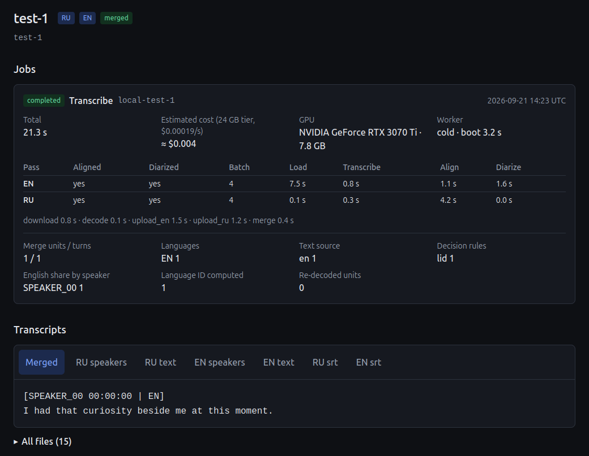
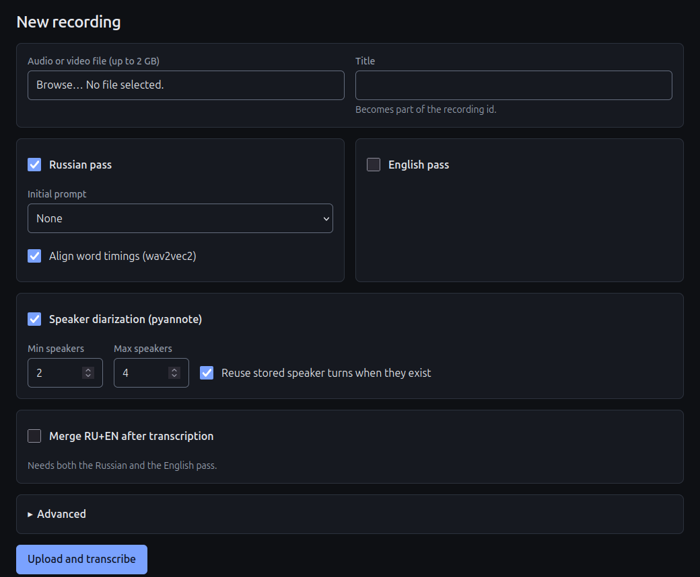
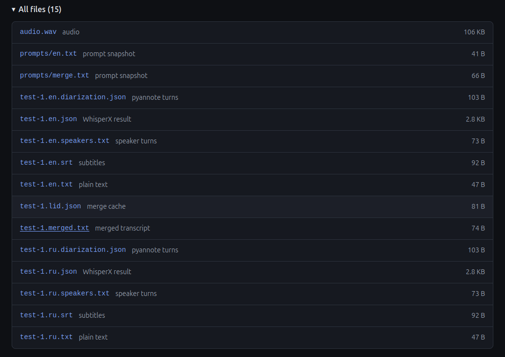
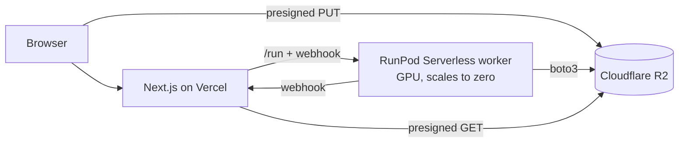

# whisperx-serverless

Meeting transcription with speaker labels for mixed Russian/English recordings, running on a
GPU that costs **$0 while idle**.

WhisperX (faster-whisper large-v3) + wav2vec2 alignment + pyannote diarization run in a RunPod
Serverless worker. Audio and transcripts live in Cloudflare R2. A Next.js app on Vercel uploads
recordings, edits prompts, starts jobs and shows the results. There is no database and no
always-on server.

[](../../actions/workflows/ci.yml)



The recording page after a run on a local RTX 3070 Ti: a 3-second test clip, two language passes
and the merge. The job card is the status document the worker writes to R2, rendered as is.

<details>
<summary>More screenshots: the run form and the files of a recording</summary>





</details>

## Architecture



1. The browser uploads audio straight to R2 with a presigned URL. RunPod's `/run` payload is
   capped at 10 MB, and the web tier never has to proxy a 100 MB file.
2. The web app submits one job per recording: every language pass plus the optional merge run
   on the same warm worker, so the audio is downloaded once and Whisper is loaded once.
3. The worker writes transcripts to R2 and, last of all, an immutable status document
   `recordings/<id>/jobs/<job id>.json`. That document is the commit marker and the only job
   state. RunPod keeps results for 30 minutes, R2 keeps them for good.
4. The recording list is a single `ListObjectsV2` call. Prompts are text files in the bucket.

## Why it costs nothing while idle

| Option | Idle cost | Problem |
|---|---|---|
| Stopped pod with a 30 GB volume | about $6 / month | the instance that sits there and bills you |
| Serverless + 15 GB network volume | about $1 / month | pins the endpoint to one data center, fewer GPUs to land on |
| Serverless + RunPod cached models | $0 | one Hugging Face model per endpoint, this pipeline needs four |
| **Serverless + weights baked into the image** | **$0** | a ~14 GB image, pulled once per host |

Serverless bills per second from worker start to stop. With zero active workers and no network
volume there is nothing left to bill between jobs. On the 24 GB tier ($0.00019/s at the time
of writing) an hour-long meeting with two language passes and a merge is estimated at
$0.10–0.15. Every job records its per-stage timings and GPU in the status document, so real
numbers replace this estimate as soon as jobs run.

## Design decisions

**Bake the weights, fetch the gated model at start.** `worker/download_models.py` runs during
the image build and then reloads everything with `HF_HUB_OFFLINE=1`, so an incomplete bake
fails the build instead of a job. pyannote is gated, so it is downloaded at worker start with
the deployer's token and never enters the image. `HF_HUB_OFFLINE` is read once when
`huggingface_hub` is imported, which is why the container starts in two processes:
`fetch_pyannote`, then the handler with the flag set.

**Three caches, three mechanisms.** The CT2 Whisper weights use faster-whisper's
`download_root`, the Russian aligner uses the Hugging Face hub cache, the English aligner is a
torchaudio bundle that goes through torch hub and ignores `HF_HUB_OFFLINE`, and the alignment
step quietly downloads NLTK `punkt_tab`. All four are baked and verified.

**From scripts to a long-lived worker.** The original scripts kept the audio and the model in
`functools.cache` keyed on module globals, which would hand job 2 the audio of job 1, and
raised `SystemExit`, which slips past `except Exception` and kills a worker. `whisper_core` is
a library without globals. One CT2 model serves transcription, language ID and re-decoding.
Diarization depends on the audio, not on the language, so it runs once per recording and is
reused by every pass.

**A forced language does not fix the output language.** WhisperX decodes ~30 s chunks, and a
chunk that starts in Russian stays Russian, translating any English inside it. Neither pass is
reliable on its own. `whisper_core/merge_ru_en.py` decides the language per speaker turn with
a fixed rule chain (language ID, alphabet evidence across passes, the speaker's usual language,
the nearest confident turn) and takes each turn's text from the pass that wrote it in the right
alphabet. Turns translated in both passes are re-transcribed alone. Greedy decoding and argmax
only: the same inputs always give the same output, and both GPU steps are cached, so
re-merging with new thresholds needs no GPU.

**Prompts are the biggest accuracy lever, within 223 tokens.** faster-whisper keeps only the
last 223 tokens of `initial_prompt` and silently drops the beginning. Russian costs about 2.8
tokens per word. The prompt editor counts tokens with Whisper's own tokenizer, and the worker
warns when a prompt is over. Prompts are written as speech, because Whisper echoes a
keyword list back into the transcript.

**Public repository, no security by obscurity.** Constant-time password check, signed
`HttpOnly` session cookie, presigned URLs only behind a session, a webhook secret, validated
object keys, one max worker and an execution timeout as the spend ceiling.

## Repository

| Path | What |
|---|---|
| `whisper_core/` | the pipeline as a library: transcription, models holder, RU/EN merge |
| `worker/` | RunPod handler, R2 storage, job validation, model download and offline checks |
| `web/` | Next.js app: upload, run form, transcripts, prompt library, public `/demo` |
| `transcribe.py`, `merge_ru_en.py` | local entry points: edit the `CONFIG` block, run the script |
| `tests/` | pytest on the pure logic with a synthetic RU/EN meeting, no GPU or torch needed |
| `docs/DEPLOY.md` | R2, RunPod, Vercel setup and the offline image check |

## Run it locally

```bash
python transcribe.py      # transcribe the files listed in CONFIG
python merge_ru_en.py     # merge the ru and en passes of one recording
pytest -q                 # pure-logic tests
```

Deploying your own copy: [docs/DEPLOY.md](docs/DEPLOY.md).

## License

MIT for the code in this repository. Model weights keep their own licenses. pyannote's
`speaker-diarization-community-1` is gated: accept its terms on Hugging Face before use.
